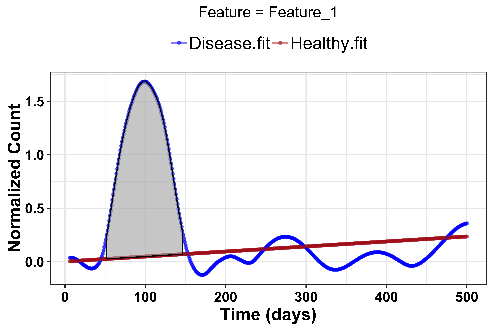

<a href="https://bioconductor.org/packages/release/bioc/html/OmicsLonDA.html"></a>
<a href="https://bioconductor.org/packages/release/bioc/html/OmicsLonDA.html"></a>
<a href="https://bioconductor.org/packages/release/bioc/html/OmicsLonDA.html"></a>
<a href="https://bioconductor.org/packages/release/bioc/html/OmicsLonDA.html"></a>


# OmicsLonDA

OmicsLonDA (Omics Longitudinal Differential Analysis) is a statistical framework
that provides robust identification of time intervals where omics features are
significantly different between groups. OmicsLonDA is based on 5 main steps:

1. Adjust measurements based on each subject's specific baseline
1. Global testing using linear mixed-effect model to select candidate features
and covariates for time intervals analysis
1. Fitting smoothing spline regression model
1. Monte Carlo permutation to generate the empirical distribution of the test
statistic
1. Inference of significant time intervals of omics features.


<br>

# Getting Started


## Prerequisites

* R(>=3.6)


## Installation

Install the latest release of OmicsLonDA from Bioconductor:
```
if (!requireNamespace("BiocManager", quietly = TRUE))
    install.packages("BiocManager")

BiocManager::install("OmicsLonDA")
```


### Example
```
library(OmicsLonDA)
library(SummarizedExperiment)

## Load 10 simulated features and metadata
data("omicslonda_data_example")
```


The measurment matrix represents count/intensity of features from an omic experiment. Columns represent various samples from different subjects longitudinally. Rows represent various features. Here is an example:
```
omicslonda_data_example$ome_matrix[1:5, 1:5]
```


The metadata dataframe contains annotations for each sample. Most impotantly it should have at least: (a) "Subject": which denote from which subject this sample is coming from,  (b) "Group": which represents which group this sample is from (eg., healthy, disease, etc), (c) "Time": which represents the collection time of the corresponding sample. Here is an example:
```
head(omicslonda_data_example$metadata)
```


## Create SummarizedExperiment object
```
se_ome_matrix = as.matrix(omicslonda_data_example$ome_matrix)
se_metadata = DataFrame(omicslonda_data_example$metadata)
omicslonda_se_object = SummarizedExperiment(assays=list(se_ome_matrix),
                                            colData = se_metadata)
```

## Adjust for baseline using CLR
```
omicslonda_se_object_adjusted = adjustBaseline(se_object = omicslonda_se_object)
```


## Measurments after baseline adjustment
```
assay(omicslonda_se_object_adjusted)[1:5, 1:5]
```


## Visualize first feature
```
omicslonda_test_object = omicslonda_se_object_adjusted[1,]
visualizeFeature(se_object = omicslonda_test_object, text = "Feature_1",
                 unit = "days", ylabel = "Normalized Count", 
                 col = c("blue", "firebrick"), prefix = "OmicsLonDA_example")
```


## Specify interval bounds
```{r}
points = seq(1, 500, length.out = 500)
```


## Run OmicsLonDA on the first feature
```
res = omicslonda(se_object = omicslonda_test_object, n.perm = 100,
                 fit.method = "ssgaussian", points = points, text = "Feature_1",
                 parall = FALSE, pvalue.threshold = 0.05, 
                 adjust.method = "BH", time.unit = "days",
                 ylabel = "Normalized Count",
                 col = c("blue", "firebrick"), prefix = "OmicsLonDA_example")
```


## Visualize fitted spline of the first feature
```
visualizeFeatureSpline(se_object = omicslonda_test_object, omicslonda_object = res, fit.method = "ssgaussian",
                        text = "Feature_1", unit = "days",
                        ylabel = "Normalized Count", 
                        col = c("blue", "firebrick"),
                        prefix = "OmicsLonDA_example")
```


## Visualize null distribution of the first feature's statistic
```
visualizeTestStatHistogram(omicslonda_object = res, text = "Feature_1", 
                                fit.method = "ssgaussian", prefix = "OmicsLonDA_example")
```


## Visulize significant time intervals of first feature
```
visualizeArea(omicslonda_object = res, fit.method = "ssgaussian",
              text = "Feature_1", unit = "days", 
              ylabel = "Normalized Count", col =
                c("blue", "firebrick"), prefix = "OmicsLonDA_example")
```





## Save OmicsLonDA results in RData file
```
save(res, file = sprintf("%s/Feature_%s_results_%s.RData",
                        prefix = "OmicsLonDA_example", text = "Feature_1", 
                        fit.method = "ssgaussian"))
```


## Save a summary of time intervals statistics in csv file
```   
feature.summary = as.data.frame(do.call(cbind, res$details),
                                stringsAsFactors = FALSE)
write.csv(feature.summary, file = sprintf("%s/Feature_%s_Summary_%s.csv",
                                          prefix = "OmicsLonDA_example", text = "Feature_1", 
                                          fit.method = "ssgaussian"), row.names = FALSE)
```


### Bugs and Suggestions
OmicsLonDA is under active research development. Please report any bugs/suggestions to Ahmed Metwally (ametwall@stanford.edu).
