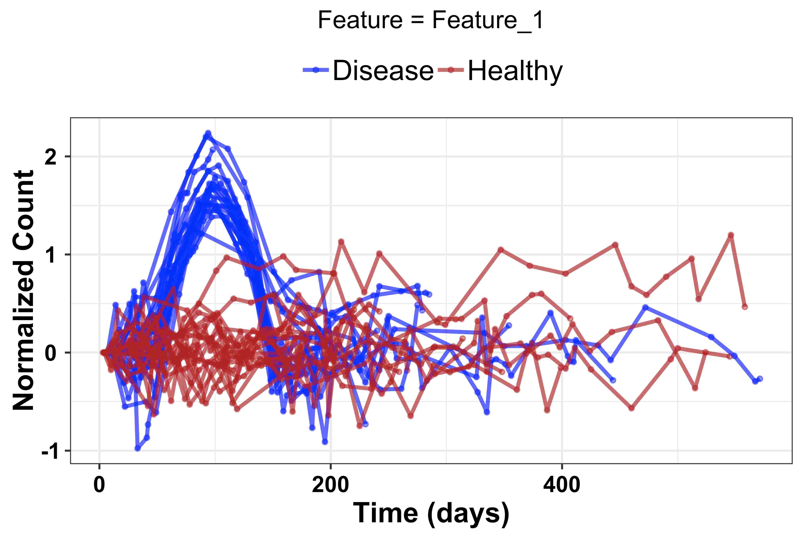
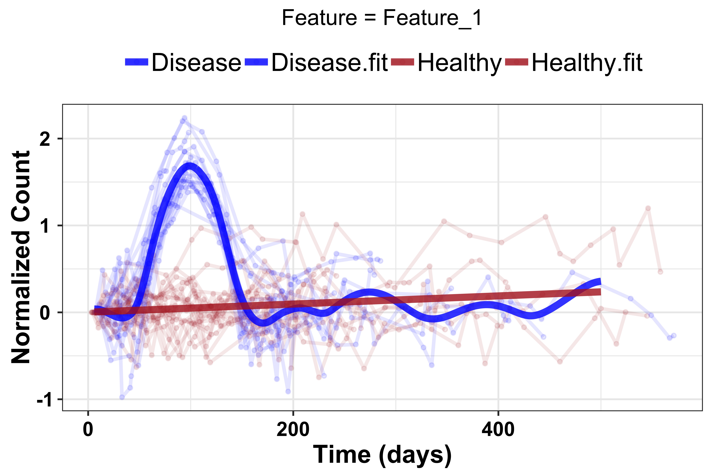
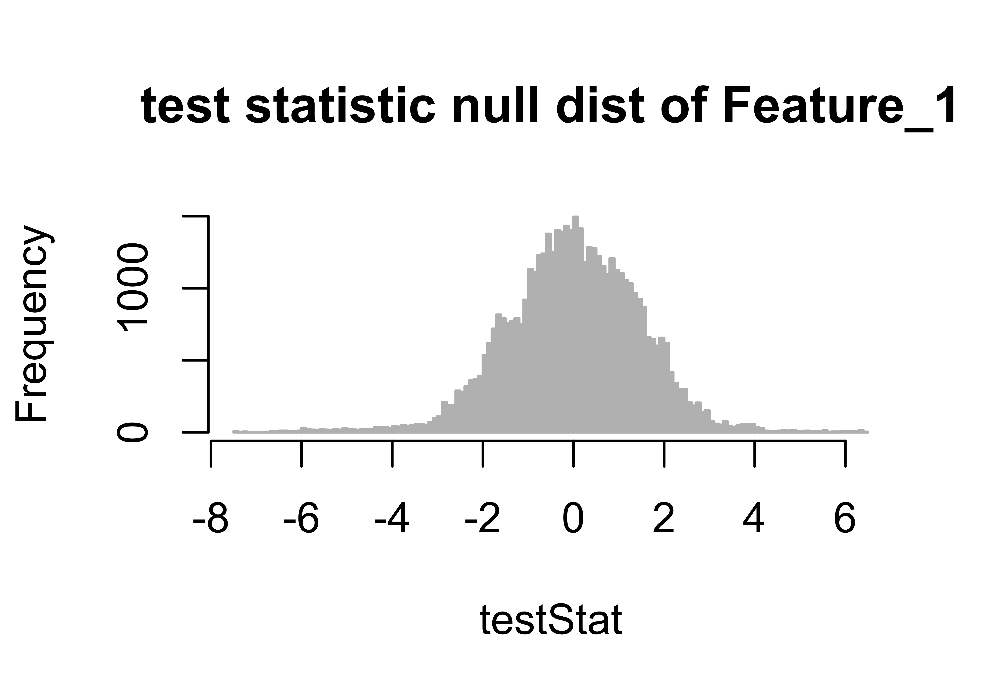

```{r setup, include = FALSE}
knitr::opts_chunk$set(
  collapse = TRUE,
  comment = "#>"
)
```

***
OmicsLonDA (Omics Longitudinal Differential Analysis) is a statistical framework
that provides robust identification of time intervals where omics features are
significantly different between groups. OmicsLonDA is based on 5 main steps:

1. Adjust measurements based on each subject's specific baseline
1. Global testing using linear mixed-effect model to select candidate features
and covariates for time intervals analysis
1. Fitting smoothing spline regression model
1. Monte Carlo simulation to generate the empirical distribution of the test
statistic
1. Inference of significant time intervals of omics features.

## Getting Started
### Prerequisites
* R(>= 3.5)

### Installation
Install the latest version of OmicsLonDA from Bioconductor:
```{r results='hide',message=FALSE,warning=FALSE}
if (!requireNamespace("BiocManager", quietly = TRUE))
    install.packages("BiocManager")
BiocManager::install("OmicsLonDA")

```

### Example
```{r, results='hide',message=FALSE,warning=FALSE}
library(OmicsLonDA)
library(SummarizedExperiment)

## Load 10 simulated features and metadata
data("omicslonda_data_example")
```


```{r}
omicslonda_data_example$ome_matrix[1:5, 1:5]

head(omicslonda_data_example$metadata)
```


## Create SummarizedExperiment object
```{r,message=FALSE,warning=FALSE}
se_ome_matrix = as.matrix(omicslonda_data_example$ome_matrix)
se_metadata = DataFrame(omicslonda_data_example$metadata)
omicslonda_se_object = SummarizedExperiment(assays=list(se_ome_matrix),
                                            colData = se_metadata)
```

## Adjust for baseline using CLR
```{r,message=FALSE,warning=FALSE}
omicslonda_se_object_adjusted = adjustBaseline(se_object = omicslonda_se_object)
```

```{r}
assay(omicslonda_se_object_adjusted)[1:5, 1:5]
```


## Visualize first feature
```{r,message=FALSE,warning=FALSE}
omicslonda_test_object = omicslonda_se_object_adjusted[1,]
visualizeFeature(se_object = omicslonda_test_object, text = "Feature_1",
                 unit = "days", ylabel = "Normalized Count", 
                 col = c("blue", "firebrick"), prefix = "OmicsLonDA_example")
```
{width=400px}


## Specify interval bounds
```{r}
points = seq(1, 500, length.out = 500)
```


## Run OmicsLonDA on the first feature
```{r,results='hide', message=FALSE,warning=FALSE}
res = omicslonda(se_object = omicslonda_test_object, n.perm = 10,
                 fit.method = "ssgaussian", points = points, text = "Feature_1",
                 parall = FALSE, pvalue.threshold = 0.05, 
                 adjust.method = "BH", time.unit = "days",
                 ylabel = "Normalized Count",
                 col = c("blue", "firebrick"), prefix = "OmicsLonDA_example")
```


## Visualize fitted spline of the first feature
```{r,message=FALSE,warning=FALSE}
visualizeFeatureSpline(se_object = omicslonda_test_object, omicslonda_object = res, method = "ssgaussian",
                        text = "Feature_1", unit = "days",
                        ylabel = "Normalized Count", 
                        col = c("blue", "firebrick"),
                        prefix = "OmicsLonDA_example")
```
{width=400px}


## Visulaize null distribution of the first feature's statistic
```{r,results='hide', message=FALSE,warning=FALSE}
visualizeTestStatHistogram(omicslonda_object = res, text = "Feature_1", 
                                method = "ssgaussian", prefix = "OmicsLonDA_example")
```
{width=400px}


## Visulize significant time intervals of first feature
```{r,message=FALSE,warning=FALSE}
visualizeArea(omicslonda_object = res, method = "ssgaussian",
              text = "Feature_1", unit = "days", 
              ylabel = "Normalized Count", col =
                c("blue", "firebrick"), prefix = "OmicsLonDA_example")
```


{width=400px}


## Bugs and Suggestions
OmicsLonDA is under active research development. Please report any
bugs/suggestions to Ahmed Metwally (ametwall@stanford.edu).

***
